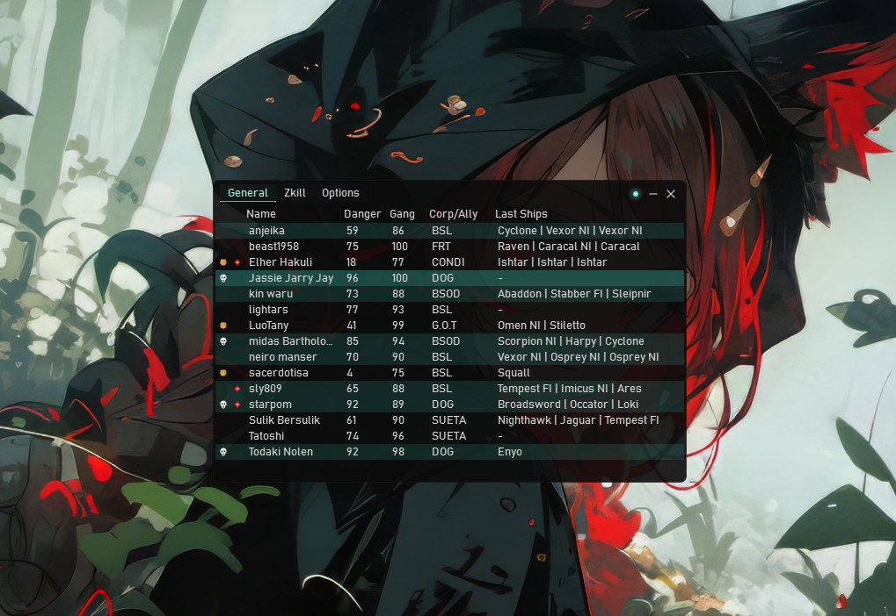
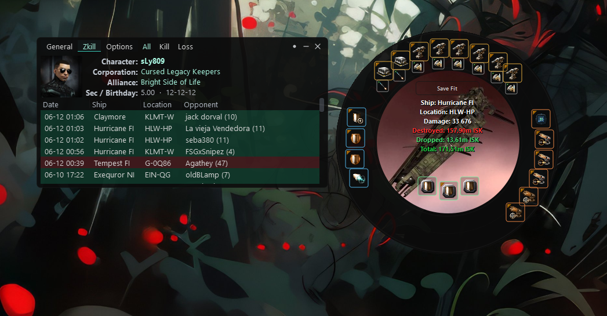
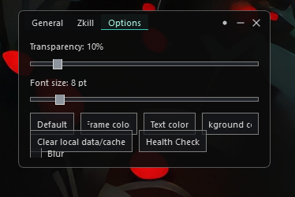

# EVE Local Intel Scanner

**EVE Local Intel Scanner** is a lightweight desktop intel tool for **EVE Online**.  
It watches copied Local chat pilot lists, resolves pilot information, shows risk indicators, and provides a compact zKillboard-style kill/loss viewer directly inside the app.

The app is designed for fast local intel checks while playing EVE Online: paste or copy Local, scan pilots, open zKill details, inspect recent ships, losses, kills and fitting layouts.

---

## Screenshots

### General overview



The General tab shows copied Local pilots with compact risk columns, corporation/alliance info and recent lost ships.  
Rows are color-highlighted for related pilots and dangerous targets.

### zKill viewer and fit popup



The built-in zKill viewer shows recent kills and losses without opening a browser.  
Clicking a row opens a native fitting-style popup with ship/structure image, module layout, damage taken and estimated ISK values.

### Options panel



The Options panel controls transparency, font size, blur, compact zKill mode, UI colors, General table columns and local cache cleanup.

> Put your screenshot files into `docs/screenshots/` with the same names used above.

---

## Main features

### Local pilot scanner

- Watches copied EVE Local chat pilot lists.
- Parses pilots from clipboard after `Ctrl+C`.
- Loads pilot rows progressively without freezing the UI.
- Displays loading spinners while pilots are being resolved.
- Shows compact columns for:
  - pilot name;
  - danger percentage;
  - gang activity percentage;
  - corporation / alliance;
  - recent lost ships.

### Risk and activity indicators

- Calculates and displays danger percentage.
- Shows gang activity percentage.
- Highlights related or linked pilots.
- Supports visual row highlighting without standard Windows-blue selection.
- Uses cyan hover and active UI accents.

### Cyno history detection

- Checks recent losses for cyno-related modules.
- Marks pilots with cyno history using a dedicated icon.
- Supports normal, covert and industrial cyno modules.

### Built-in zKill viewer

- Opens pilot zKill data inside the app.
- Supports:
  - All;
  - Kill;
  - Loss.
- Uses a custom compact table instead of an embedded browser.
- Shows recent kills and losses with color-coded backgrounds.
- Supports character header with:
  - avatar;
  - character name;
  - corporation;
  - alliance;
  - security status;
  - birthday.

### Native fit popup

- Opens by clicking any row in the zKill table.
- Shows a round EVE-style fitting panel.
- Displays:
  - ship or structure image;
  - high/mid/low/rig module layout;
  - ammo and charges;
  - ship/location/damage summary;
  - destroyed, dropped and total ISK values.
- Supports `Save Fit` export to clipboard.
- Uses current UI colors for frame, text and button styling.
- Follows the main app window position.
- Can be closed with right click or middle click.

### Local SQLite database

- Stores local killmail intel in SQLite.
- Uses local DB data for faster startup and zKill loading.
- Supports fast import of killmail archives.
- Uses optimized SQLite settings:
  - WAL mode;
  - bulk inserts;
  - deferred index rebuild during import;
  - fast archive processing.
- Does not resolve ESI names during import, keeping DB creation faster.

### UI customization

- Adjustable transparency.
- Optional blur.
- Font size control.
- Compact zKill mode.
- Custom frame color.
- Custom text color.
- Custom background color.
- General table column visibility settings.
- Window size and position persistence.
- Column width persistence.

### Cache management

The `Clear Local Data/Cache` button can clear disposable data:

- cache files;
- avatar cache;
- logs;
- temporary cache folder content.

It does **not** delete:

- SQLite database;
- user settings;
- table/window settings;
- killmail archives.

---

## Installation

### Option 1: Run from source

```bash
python -m venv .venv
.venv\Scripts\activate
pip install -r requirements.txt
python main.py
```

### Option 2: Build Windows installer

The project includes PyInstaller and Inno Setup build files.

```bat
build_setup.bat
```

The installer output is created in:

```text
installer_output\EVE_Local_Intel_Scanner_Setup.exe
```

Requirements for building:

- Windows 10/11;
- Python 3.11+ recommended;
- Inno Setup 6;
- project dependencies installed in `.venv`.

---

## Usage

1. Start EVE Online.
2. Select pilot names in Local chat.
3. Press `Ctrl+C`.
4. The app automatically reads the copied pilot list.
5. Review pilot danger, gang activity, corp/alliance and recent ships.
6. Double-click or open zKill data for deeper kill/loss history.
7. Click a zKill row to inspect the fitting popup.

---

## Data sources

The application uses public EVE-related data sources:

- EVE ESI API;
- zKillboard public API;
- local SQLite cache/database;
- locally imported killmail archive data.

---

## Project structure

```text
main.py                  App entry point
ui.py                    Main window and UI logic
intel_table.py           General pilot table
row_renderer.py          General table row rendering
options_panel.py         Options tab
zkill_panel.py           zKill tab container
zkill_viewer.py          Custom zKill viewer
zkill_compact_table.py   zKill kill/loss table
zkill_fit_popup.py       Native fitting popup
local_intel_updater.py   Local DB archive updater/importer
local_intel_db.py        SQLite local intel access
user_settings.py         Persistent user settings
installer.iss            Inno Setup installer script
```

---

## Notes

This tool is an external local intel assistant.  
It does not automate gameplay and does not control the EVE Online client.

---

## License

Add your license here.
